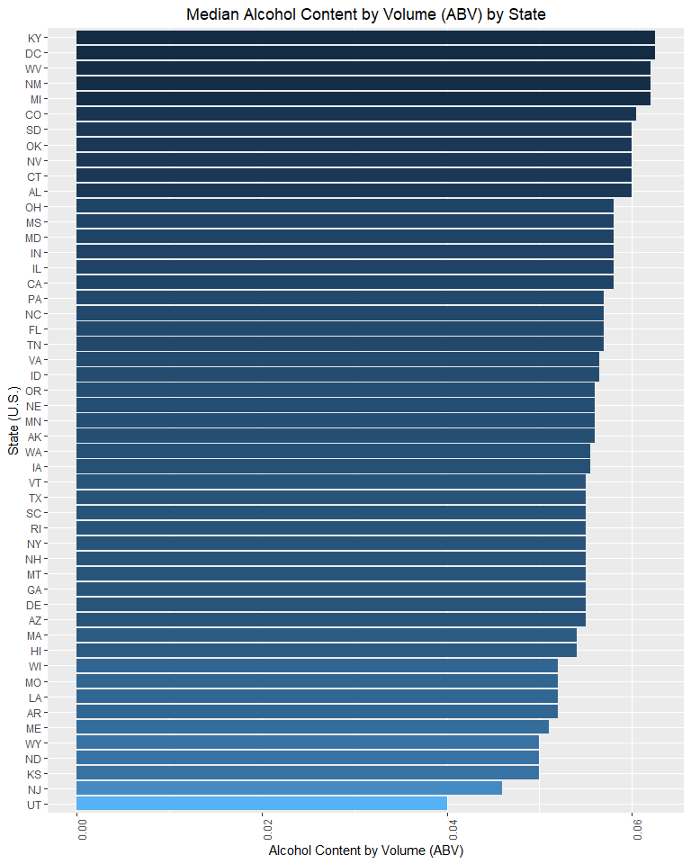
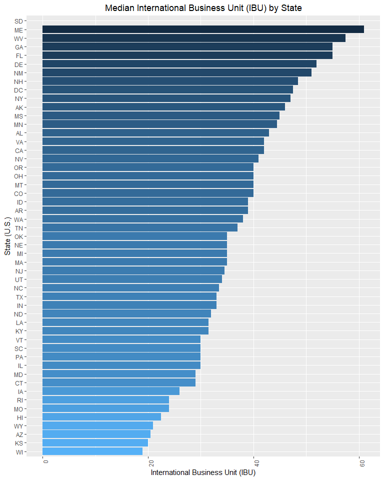
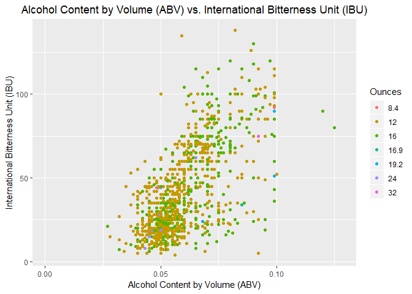

# Introduction 
This report provides an analysis of craft beers and Brewery distributors of those beers through out the USA. As your team has expressed interest in understanding where competitors are currently located, how saturated the market in each state is and also assistance in determining the composition of your next beer product (in terms of alcohol by volume (ABV) and bitterness (IBU)), we've prepared the following analysis which should solve for those needs. Through this analysis and additional follow-on discussions with your team and other relevant business partners, we feel that you will be positioned to make the best decision for your organization.


## Specifications
>*Here we display the number of Breweries by each state. This will allow you to know who your competitors are and what state has the most Breweries which should assist with favorable location identification. We suggest also factoring in the composition of ABV and IBU for beer products in those states before choosing a location.*


```r
# Read the data files
b_beers <- read.csv("./Raw_Data/Beers.csv")
str(b_beers)
```

```
## 'data.frame':	2410 obs. of  7 variables:
##  $ Name      : Factor w/ 2305 levels "#001 Golden Amber Lager",..: 1638 577 1705 1842 1819 268 1160 758 1093 486 ...
##  $ Beer_ID   : int  1436 2265 2264 2263 2262 2261 2260 2259 2258 2131 ...
##  $ ABV       : num  0.05 0.066 0.071 0.09 0.075 0.077 0.045 0.065 0.055 0.086 ...
##  $ IBU       : int  NA NA NA NA NA NA NA NA NA NA ...
##  $ Brewery_id: int  409 178 178 178 178 178 178 178 178 178 ...
##  $ Style     : Factor w/ 100 levels "","Abbey Single Ale",..: 19 18 16 12 16 80 18 22 18 12 ...
##  $ Ounces    : num  12 12 12 12 12 12 12 12 12 12 ...
```

```r
a_breweries <- read.csv("./Raw_Data/Breweries.csv")
str(a_breweries)
```

```
## 'data.frame':	558 obs. of  4 variables:
##  $ Brew_ID: int  1 2 3 4 5 6 7 8 9 10 ...
##  $ Name   : Factor w/ 551 levels "10 Barrel Brewing Company",..: 355 12 266 319 201 136 227 477 59 491 ...
##  $ City   : Factor w/ 384 levels "Abingdon","Abita Springs",..: 228 200 122 299 300 62 91 48 152 136 ...
##  $ State  : Factor w/ 51 levels " AK"," AL"," AR",..: 24 18 20 5 5 41 6 23 23 23 ...
```

>*Here are counts of Breweries listed by each State. In total we observed 558 breweries with the largest concentration of breweries located in Colorado. *


```r
a1_breweries <- data.frame(sqldf("SELECT State, COUNT(*) as BrewCount FROM a_breweries GROUP BY State ORDER BY COUNT(*) DESC"))  # count of breweries by state
a1_breweries
```

```
##    State BrewCount
## 1     CO        47
## 2     CA        39
## 3     MI        32
## 4     OR        29
## 5     TX        28
## 6     PA        25
## 7     MA        23
## 8     WA        23
## 9     IN        22
## 10    WI        20
## 11    NC        19
## 12    IL        18
## 13    NY        16
## 14    VA        16
## 15    FL        15
## 16    OH        15
## 17    MN        12
## 18    AZ        11
## 19    VT        10
## 20    ME         9
## 21    MO         9
## 22    MT         9
## 23    CT         8
## 24    AK         7
## 25    GA         7
## 26    MD         7
## 27    OK         6
## 28    IA         5
## 29    ID         5
## 30    LA         5
## 31    NE         5
## 32    RI         5
## 33    HI         4
## 34    KY         4
## 35    NM         4
## 36    SC         4
## 37    UT         4
## 38    WY         4
## 39    AL         3
## 40    KS         3
## 41    NH         3
## 42    NJ         3
## 43    TN         3
## 44    AR         2
## 45    DE         2
## 46    MS         2
## 47    NV         2
## 48    DC         1
## 49    ND         1
## 50    SD         1
## 51    WV         1
```

>*We merged the two data files and listed the top 6 records and the last 6 records in the merged file to examine the data post merge.*


```r
b1_beers <- data.frame(sqldf("SELECT * FROM a_breweries a INNER JOIN b_beers b ON a.Brew_ID = b.Brewery_ID"))  # merge the two files

head(b1_beers,6)  # list the first 6 obs in merged file
```

```
##   Brew_ID               Name        City State       Name..5 Beer_ID   ABV
## 1       1 NorthGate Brewing  Minneapolis    MN  Get Together    2692 0.045
## 2       1 NorthGate Brewing  Minneapolis    MN Maggie's Leap    2691 0.049
## 3       1 NorthGate Brewing  Minneapolis    MN   Parapet ESB    2687 0.056
## 4       1 NorthGate Brewing  Minneapolis    MN       Pumpion    2689 0.060
## 5       1 NorthGate Brewing  Minneapolis    MN    Stronghold    2688 0.060
## 6       1 NorthGate Brewing  Minneapolis    MN    Wall's End    2690 0.048
##   IBU Brewery_id                               Style Ounces
## 1  50          1                        American IPA     16
## 2  26          1                  Milk / Sweet Stout     16
## 3  47          1 Extra Special / Strong Bitter (ESB)     16
## 4  38          1                         Pumpkin Ale     16
## 5  25          1                     American Porter     16
## 6  19          1                   English Brown Ale     16
```

```r
tail(b1_beers,6)  # list the last 6 obs in the merged file
```

```
##      Brew_ID                          Name          City State
## 2405     556         Ukiah Brewing Company         Ukiah    CA
## 2406     557       Butternuts Beer and Ale Garrattsville    NY
## 2407     557       Butternuts Beer and Ale Garrattsville    NY
## 2408     557       Butternuts Beer and Ale Garrattsville    NY
## 2409     557       Butternuts Beer and Ale Garrattsville    NY
## 2410     558 Sleeping Lady Brewing Company     Anchorage    AK
##                        Name..5 Beer_ID   ABV IBU Brewery_id
## 2405             Pilsner Ukiah      98 0.055  NA        556
## 2406  Heinnieweisse Weissebier      52 0.049  NA        557
## 2407         Moo Thunder Stout      50 0.049  NA        557
## 2408         Porkslap Pale Ale      49 0.043  NA        557
## 2409           Snapperhead IPA      51 0.068  NA        557
## 2410 Urban Wilderness Pale Ale      30 0.049  NA        558
##                        Style Ounces
## 2405         German Pilsener     12
## 2406              Hefeweizen     12
## 2407      Milk / Sweet Stout     12
## 2408 American Pale Ale (APA)     12
## 2409            American IPA     12
## 2410        English Pale Ale     12
```

>*We identify the number of "NA's" in each columns so that we can cleanup the data and make it more readable.* 
>*We detected NA values primarily in the IBU and ABV column which matches the raw data. Please keep this in mind when analyzing results.*


```r
c_na <- colSums(is.na(b1_beers))  # count the number of NAs in each column
c_na                               
```

```
##    Brew_ID       Name       City      State    Name..5    Beer_ID 
##          0          0          0          0          0          0 
##        ABV        IBU Brewery_id      Style     Ounces 
##         62       1005          0          0          0
```

>*Here are alcohol content and IBU values are summarized for each state using the median values of each.* 


```r
d_median <- data.frame(sqldf("SELECT State, MEDIAN(ABV), MEDIAN(IBU) FROM b1_beers GROUP BY State"))
str(d_median)
```

```
## 'data.frame':	51 obs. of  3 variables:
##  $ State      : Factor w/ 51 levels " AK"," AL"," AR",..: 1 2 3 4 5 6 7 8 9 10 ...
##  $ MEDIAN.ABV.: num  0.056 0.06 0.052 0.055 0.058 0.0605 0.06 0.0625 0.055 0.057 ...
##  $ MEDIAN.IBU.: num  46 43 39 20.5 42 40 29 47.5 52 55 ...
```

#### Included below are Plots
>*Here we plot the median ABV and IBU respectively by each state to help identify which states may be more favorable and/or primed for your product positioning.*


```r
# create the graph - Median ABV
ggplot(d_median, aes(x = reorder(State, MEDIAN.ABV.), y = MEDIAN.ABV., fill = -MEDIAN.ABV.)) + 
  geom_bar(stat = "identity", position="dodge",  na.rm = TRUE) + 
  theme(axis.text.x = element_text(angle = 90, hjust = 1), legend.position = "none") + 
  ggtitle("Median Alcohol Content by Volume (ABV) by State") + theme(plot.title = element_text(hjust = 0.5)) + 
  labs(x = "State (U.S.)", y = "Alcohol Content by Volume (ABV)") +
  coord_flip() # flips the chart
```

<!-- -->

```r
# create the graph - Median IBU
ggplot(d_median, aes(x = reorder(State, MEDIAN.IBU.), y = MEDIAN.IBU., fill = -MEDIAN.IBU.)) + 
  geom_bar(stat = "identity", position="dodge",  na.rm = TRUE) + 
  theme(axis.text.x = element_text(angle = 90, hjust = 1), legend.position = "none") + 
  ggtitle("Median International Business Unit (IBU) by State") + theme(plot.title = element_text(hjust = 0.5)) + 
  labs(x = "State (U.S.)", y = "International Business Unit (IBU)") +
  coord_flip() # flips the chart
```

<!-- -->

### Alcohol Content
>*This section will list and rank maximum alcoholic content for ABV by state in descending order and the most bitter IBU beer by state in descending order.*
>*The top two states listed below one for each category (ABV, IBU), (Colorado for max ABV) and (Oregon for bitter IBU).* 


```r
e <- data.frame(sqldf("SELECT State, MAX(ABV) FROM b1_beers GROUP BY State ORDER BY ABV DESC"))  # rank order by state and ABV to check
e <- data.frame(sqldf("SELECT State, MAX(ABV) FROM b1_beers where ABV = (SELECT MAX(ABV) FROM b1_beers) GROUP BY State"))  # state with the highest ABV
head(e)
```

```
##   State MAX.ABV.
## 1    CO    0.128
```

```r
f <- data.frame(sqldf("SELECT State, MAX(IBU) FROM b1_beers GROUP BY State ORDER BY IBU DESC"))  # rank order by state and IBU to check
f <- data.frame(sqldf("SELECT State, MAX(IBU) FROM b1_beers where IBU = (SELECT MAX(IBU) FROM b1_beers) GROUP BY State"))  # state with the highest IBU
head(f)
```

```
##   State MAX.IBU.
## 1    OR      138
```

#### Summary by columns for ABV and IBU
>*Here we provide summary statistics for the ABV and IBU values to help provide a perspective on the specific ranges and statistics.*

```r
summary(b1_beers$ABV)  # summary stats for ABV
```

```
##    Min. 1st Qu.  Median    Mean 3rd Qu.    Max.    NA's 
## 0.00100 0.05000 0.05600 0.05977 0.06700 0.12800      62
```

```r
summary(b1_beers$IBU)  # summary stats for IBU
```

```
##    Min. 1st Qu.  Median    Mean 3rd Qu.    Max.    NA's 
##    4.00   21.00   35.00   42.71   64.00  138.00    1005
```

#### Included below are Plots
>*Here we plot the ABV and IBU for each state in an attempt to discern if there is a relationship between ABV and IBU.*
>*Note: there does appear to be a linear relationship between ABV and IBU; we've added in ounces as a dimension for each point as well.*
>*With regards to this analysis, when determine where to position your product, please keep in mind that the higher the ABV, the higher the IBU which could also factor into location preferences as Colorado has the highest ABV but Oregon has the highest IBU.*


```r
ggplot(b1_beers, aes(x=ABV, y=IBU, color = factor(b1_beers$Ounces))) + 
  geom_point(na.rm = TRUE) +
  ggtitle("Alcohol Content by Volume (ABV) vs. International Bitterness Unit (IBU)") + theme(plot.title = element_text(hjust = 0.5)) + 
  labs(x = "Alcohol Content by Volume (ABV)", y = "International Bitterness Unit (IBU)", color = "Ounces")
```

<!-- -->

# Summary
Based on the problem statement your team initially asked us to examine: 1) where competitors are currently located and how saturated the market in each state is and 2) also assistance in determining the composition of your next beer product (in terms of alcohol by volume (ABV) and bitterness (IBU)) we recommend the following:
1) Avoid constructing your new brewery in Colorado. Our analysis finds that the state is saturated with breweries already and comeptition will be stiff. We suggest exploring states like Texas or Pensylvania as these states have a mid-level concentration of breweries and appear to have some relative room for additional competion.
2) When developing your next beer product, please keep in mind that a higher ABV will influence the bitterness of the beer. If bitterness is a key trait for this new product, then ensure the ABV concentration is high. However, if bitterness is something you're wishing to control, we suggest limiting the ABV to reasonable amounts. We also suggest factoring in location considerations with regards to the bitterness decision; our data shows that Oregon is the state with the highest concentration of bitter beers, yet the number of breweries is well below the number present in Colorado. This could signal a high demand for this type of beer product in that state which at a minimum warrants further investigation.
